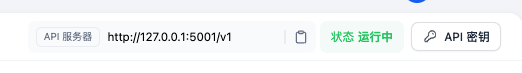
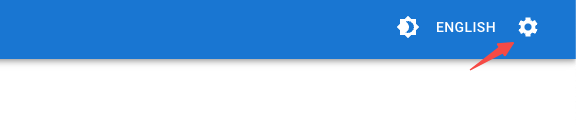
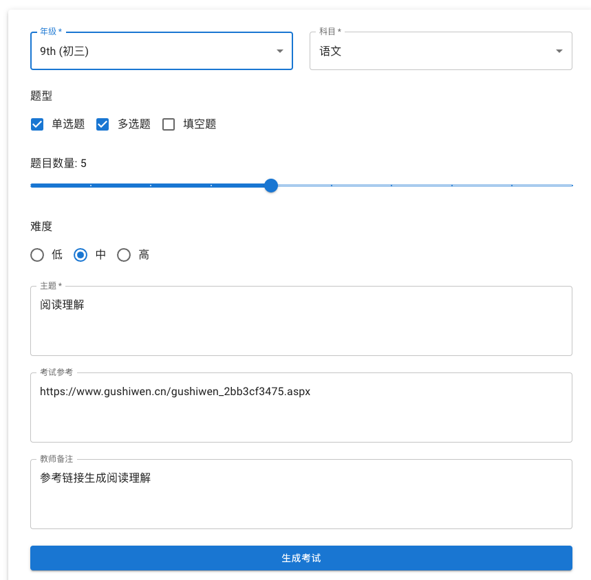
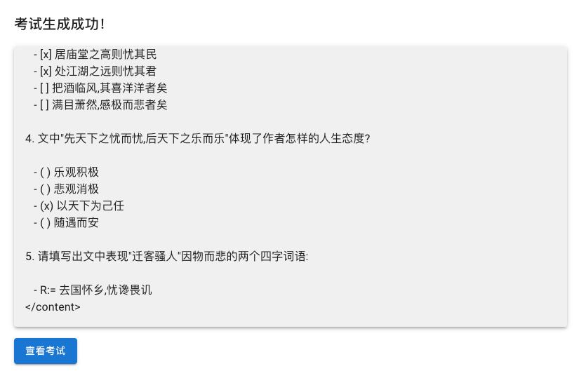
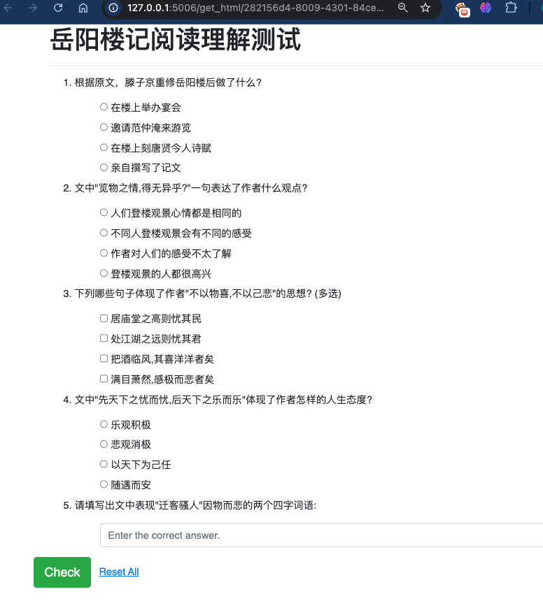
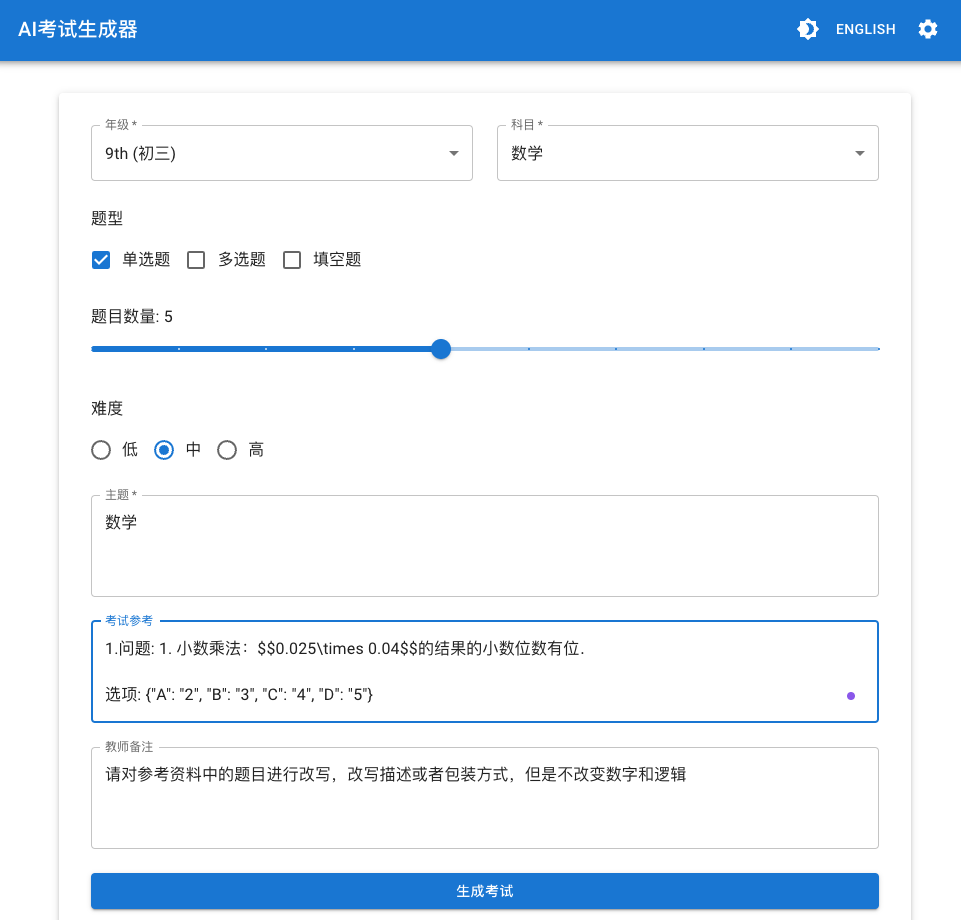
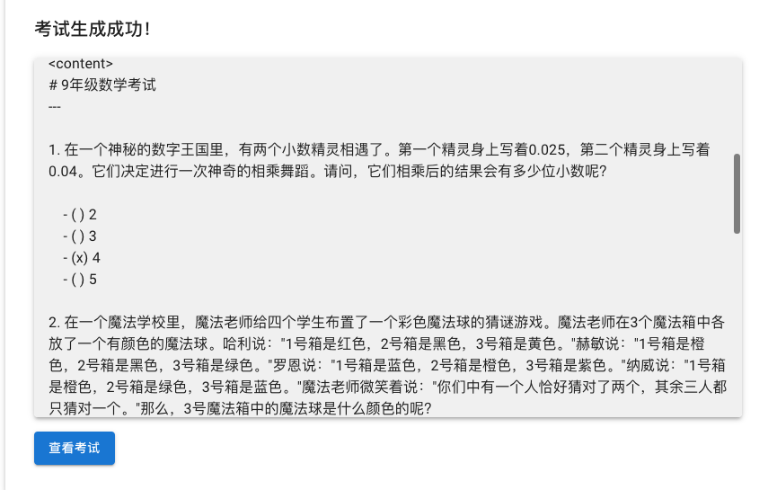
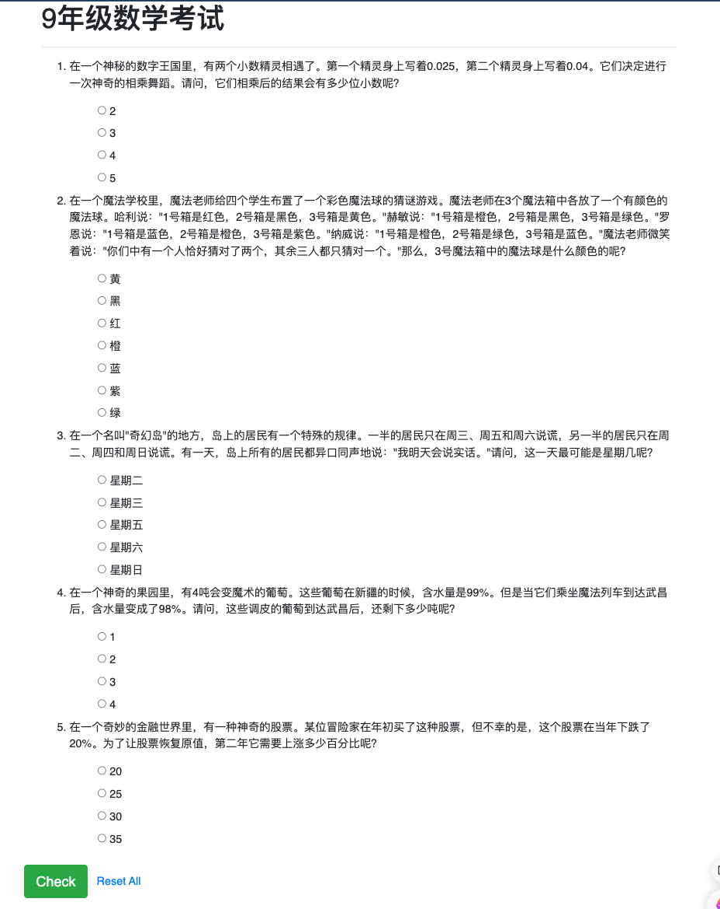
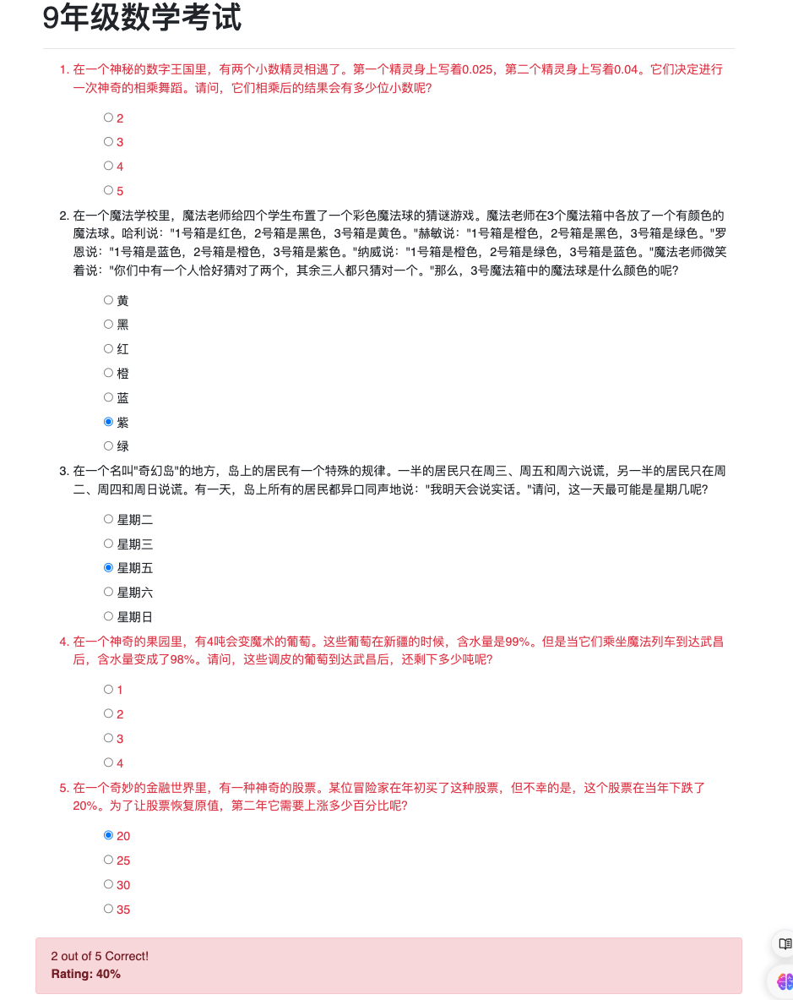

# AI 考试生成器
## 基本介绍
本项目是AI在教育领域中的应用演示，可以设置年级，科目，题目数量，题型，主题，参考资料,备注要求等信息后，自动生成对应的考试题目及对应的正确答案。
并且生成一个考试答卷链接，模拟做题，并自动算分。  
使用场景有：  
- 根据输入要求，完全由AI自动出题
- 提供学习资料或者知识点，按对应的知识点出题
- 提供题库，对原有题库进行改写或扩充


## 运行环境
1. 前端采用React Typescipt
2. 后端使用[Dify工作流](https://docs.dify.ai/zh-hans)

## 前端启动
1. 安装 [nodejs](https://nodejs.org/en/download/package-manager) 
2. 安装 [yarn](https://classic.yarnpkg.com/en/docs/install/) `sudo npm install -g yarn`
2. 下载项目代码后，进入ai-exam-generator目录，执行`yarn install`, 
3. 执行`yarn dev` 启动前端web
4. 访问 http://localhost:5173/

## 后端启动
1. 安装dify，参考dify官方文档 https://docs.dify.ai/zh-hans
2. 在dify上导入 [创建试卷工作流](./dify_tools/创建试卷工作流-2.yml)
3. 找到工作流API密钥  
   
然后配置到到AI 考试生成器前端页面     
  
4. 进入dify_tools/quiz-flask-service目录，打包quiz-flask-service,并运行。 参考说明[README](./dify_tools/quiz-flask-service/README.md)


## 场景示例
1. 参考已有资料生成题目  
- 填写输入信息   
这里我们输入一个关于岳阳楼记的链接https://www.gushiwen.cn/gushiwen_2bb3cf3475.aspx，生成阅读理解题  


- 点击生成  

- 点击查看考试开始试卷  


2. 题目改写
- 填写输入信息  
教师备注填入 `请对参考资料中的题目进行改写，改写描述或者包装方式，但是不改变数字和逻辑`  

- 填入需要改写的参考题目  
```
1.问题: 1. 小数乘法：$$0.025\times 0.04$$的结果的小数位数有位． 

选项: {"A": "2", "B": "3", "C": "4", "D": "5"}

答案: B

2.问题: 【$$2020$$五年级卷第$$33$$题】斯普林特老师在$$3$$个小箱中各放一个有颜色的球，让四只忍者神龟猜箱子中球的颜色．  李奥纳多说：``$$1$$号箱中放红球，$$2$$号箱中放黑球，$$3$$号箱中放黄球．''  拉斐尔说：``$$1$$号箱中放橙球，$$2$$号箱中放黑球，$$3$$号箱中放绿球．''  米开朗琪罗说：``$$1$$号箱中放蓝球，$$2$$号箱中放橙球，$$3$$号箱中放紫球．''  多纳泰罗说：``$$1$$号箱中放橙球，$$2$$号箱中放绿球，$$3$$号箱中放蓝球．''  斯普林特老师说：``你们中有一个人恰好猜对了两个，其余三人都只猜对一个．''  那么$$3$$号箱中放的是球． 

选项: {"A": "黄", "B": "黑", "C": "红", "D": "橙", "E": "蓝", "F": "紫", "G": "绿"}

答案: F

3. 问题: 谎言岛有一半的人只在星期三、星期五、星期六说谎，另一半的人只在星期二、星期四、星期日说谎．某一天，岛上的所有人都说：``我明天说真话．''那么，这一天是．（2021年新希望杯二年级竞赛初赛数学试卷） 

选项: {"A": "星期二", "B": "星期三", "C": "星期五", "D": "星期六", "E": "星期日"}

答案: C

4.问题: $$4$$吨葡萄在新疆测得含水量为$$99 \%$$，运抵武昌后测得含水量为$$98 \%$$，运抵武昌后，葡萄还剩吨． 

选项: {"A": "1", "B": "2", "C": "3", "D": "4"}

答案: B

5.问题: 某人年初买了一种股票，该股票当年下跌了$$20 \%$$，第二年应上涨$$ \%$$才能恢复原值． 

选项: {"A": "20", "B": "25", "C": "30", "D": "35"}

答案: B
```

- 点击生成  

- 查看试卷  

- 做题并判卷  
